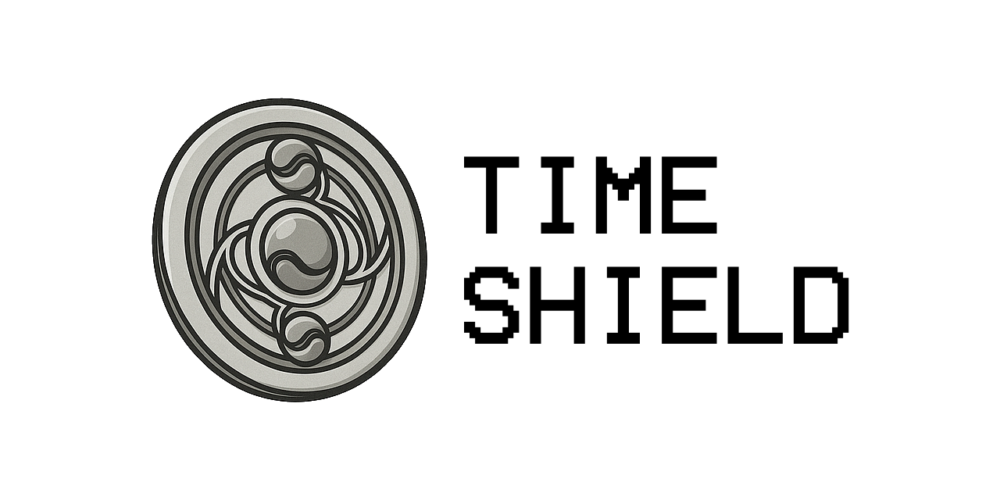

# Time Shield



**Time Shield** — это ~~не только оружие Хомуры Акэми, но и~~ header-only C++-библиотека для работы со временем. Она включает функции для конвертации временных значений, форматирования дат и множество утилит для задач с таймстампами.

## Возможности

- **Проверка дат** — валидация дат с учётом високосных лет и выходных.
- **Форматирование времени** — преобразование таймстампов в строки по стандартным и пользовательским шаблонам.
- **Конвертации** — перевод между секундными, миллисекундными и плавающими представлениями времени, структуры `DateTimeStruct` и временные зоны.
- **Утилиты** — получение текущих меток времени, вычисления начала/конца периодов, работа с частями секунды.
- **Преобразование часовых поясов** — функции для CET/EET в GMT.
- **NTP‑клиент** — получение точного времени по сети (только Windows).
- **Поддержка MQL5** — адаптированные заголовки в каталоге `MQL5` позволяют использовать библиотеку в MetaTrader.
- Совместимость с `C++11` – `C++17`.

> Часть функций зависит от WinAPI и будет работать только под Windows (например, `NtpClient` или получение realtime через `QueryPerformanceCounter`).

## Установка и настройка

Библиотека поставляется в виде заголовков. Для подключения достаточно добавить путь `include/time_shield_cpp` в проект и подключить основной файл:

```cpp
#include <time_shield.hpp>
```

Примеры можно собрать скриптом `build-examples.bat`. Для установки файлов MQL5 предусмотрен `install_mql5.bat`.

## Примеры использования

Ниже приведены небольшие примеры из разделов библиотеки.

### Получение и конвертация времени

```cpp
#include <time_shield/time_utils.hpp>
#include <time_shield/time_conversions.hpp>

using namespace time_shield;

ts_t now = ts();                 // секунды с эпохи
fts_t now_f = fts();             // время в секундах с дробной частью
int ms_part = ms_of_sec(now_f);  // миллисекундная часть
```

### Форматирование дат

```cpp
#include <time_shield/time_formatting.hpp>

std::string iso = to_iso8601(now);          // 2024-06-21T12:00:00
std::string custom = to_string("%Y-%m-%d %H:%M:%S", now);
std::string mql5 = to_mql5_date_time(now);  // 2024.06.21 12:00:00
std::string filename = to_windows_filename(now);
```

### Парсинг ISO8601

```cpp
#include <time_shield/time_parser.hpp>

DateTimeStruct dt;
TimeZoneStruct tz;
if (parse_iso8601("2024-11-25T14:30:00+01:00", dt, tz)) {
    ts_t ts_val = to_timestamp(dt) + to_offset(tz);
}
```

### Конвертация часовых поясов

```cpp
#include <time_shield/time_zone_conversions.hpp>

ts_t cet = to_ts(2024, Month::JUN, 21, 12, 0, 0);
ts_t gmt = cet_to_gmt(cet);
```

### NTP‑клиент (Windows)

```cpp
#include <time_shield/ntp_client.hpp>

NtpClient client;
if (client.query()) {
    int64_t offset = client.get_offset_us();
    int64_t utc_ms = client.get_utc_time_ms();
}
```

## Документация

Полное описание API и дополнительные примеры доступны по адресу: <https://newyaroslav.github.io/time-shield-cpp/>

## Лицензия

Проект распространяется по лицензии [MIT](LICENSE).

