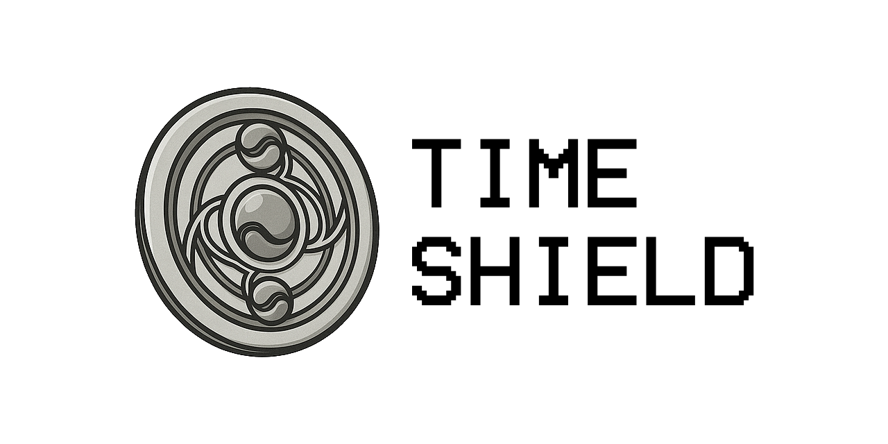

# Time Shield




**Time Shield** is a header-only C++ library for working with time. It provides
functions for converting time values, formatting dates and many utilities for
working with timestamps.
> Named after Homura Akemi's "time shield".

See the [Russian version](README-RU.md) for documentation in Russian.

## Why Time Shield?

**Time Shield** was created as a practical tool for handling time in C++ with a
focus on application and engineering tasks. Unlike the standard `std::chrono` or
more academic solutions like `HowardHinnant/date`, the library:

- uses simple types (`int64_t`, `double`) to represent time (`ts_t`, `fts_t`)
  making them easy to log, serialize and pass through JSON, RPC and databases;
  no overloaded `std::chrono` classes;
- supports **multiple time representations**: Unix time, fractional seconds,
  milli- and microseconds, OLE Automation (Excel), Julian dates;
- includes **utilities for rounding, formatting, ISO8601 parsing**, working with
  parts of a timestamp and calculating period boundaries;
- has an **extensible architecture**—new formats (Julian, OLE, UTC offset) can be
  added as separate types and modules;
- **works even in restricted environments** such as MQL5/MetaTrader—no
  exceptions, STL containers or dynamic memory are required;
- ships as **header-only**—a single include without build steps or external
  dependencies;
- uses only **standard STL headers and system APIs**; modules that depend on
  WinAPI (e.g., `NtpClient`) are isolated and do not hinder cross-platform
  builds.

## Features

- **Date validation**—checks dates for leap years and weekends.
- **Time formatting**—converts timestamps to strings with standard or custom
  templates.
- **Conversions**—translates between second, millisecond and floating time
  representations, `DateTimeStruct` and time zones.
- **Utilities**—fetches current timestamps, computes start/end of periods and
  works with fractions of a second.
- **Time zone conversion**—functions for CET/EET to GMT.
- **NTP client**—obtains accurate time over the network (Windows only).
- **MQL5 support**—adapted headers in the `MQL5` directory allow using the
  library in MetaTrader.
- Compatible with `C++11`–`C++17`.

> Some functions depend on WinAPI and work only on Windows (for example,
> `NtpClient` or obtaining realtime via `QueryPerformanceCounter`).

## Installation and Setup

The library is header-only and can be consumed with CMake:

```cmake
cmake_minimum_required(VERSION 3.18)
project(app LANGUAGES CXX)

find_package(TimeShield CONFIG REQUIRED)

add_executable(app main.cpp)
target_link_libraries(app PRIVATE time_shield::time_shield)
```

### vcpkg

Install via a local overlay port:

```sh
vcpkg install time-shield-cpp --overlay-ports=./vcpkg-overlay/ports
```

Use the vcpkg toolchain when configuring CMake:

```sh
cmake -B build -S . -DCMAKE_TOOLCHAIN_FILE=/path/to/vcpkg/scripts/buildsystems/vcpkg.cmake
```

The port is intended to be upstreamed to [microsoft/vcpkg](https://github.com/microsoft/vcpkg).

Examples can be built with the provided scripts:

- `build-examples.bat` for Windows;
- `build_examples.sh` for Linux/macOS;
- `build-cb.bat` to generate a Code::Blocks project.

Use `install_mql5.bat` to install the MQL5 files.

## Submodule / add_subdirectory

To vendor the library, add it as a Git submodule:

```sh
git submodule add https://github.com/NewYaroslav/time-shield-cpp external/time-shield-cpp
```

Then include it in your project with CMake:

```cmake
add_subdirectory(external/time-shield-cpp)

add_executable(app main.cpp)
target_link_libraries(app PRIVATE time_shield::time_shield)
```

## Usage Examples

Below are small examples from different sections of the library.

### Getting and converting time

```cpp
#include <time_shield/time_utils.hpp>
#include <time_shield/time_conversions.hpp>

using namespace time_shield;

ts_t now = ts();                 // seconds since epoch
fts_t now_f = fts();             // time in seconds with fraction
int ms_part = ms_of_sec(now_f);  // millisecond part
```

### Date formatting

```cpp
#include <time_shield/time_formatting.hpp>

std::string iso = to_iso8601(now);          // 2024-06-21T12:00:00
std::string custom = to_string("%Y-%m-%d %H:%M:%S", now);
std::string mql5 = to_mql5_date_time(now);  // 2024.06.21 12:00:00
std::string filename = to_windows_filename(now);
```

### ISO8601 parsing

```cpp
#include <time_shield/time_parser.hpp>

DateTimeStruct dt;
TimeZoneStruct tz;
if (parse_iso8601("2024-11-25T14:30:00+01:00", dt, tz)) {
    ts_t ts_val = to_timestamp(dt) + to_offset(tz);
}
```

### Time zone conversion

```cpp
#include <time_shield/time_zone_conversions.hpp>

ts_t cet = to_ts(2024, Month::JUN, 21, 12, 0, 0);
ts_t gmt = cet_to_gmt(cet);
```

### NTP client (Windows)

```cpp
#include <time_shield/ntp_client.hpp>

NtpClient client;
if (client.query()) {
    int64_t offset = client.get_offset_us();
    int64_t utc_ms = client.get_utc_time_ms();
}
```

## Documentation

Full API description and additional examples are available at
<https://newyaroslav.github.io/time-shield-cpp/>

## License

The project is distributed under the [MIT](LICENSE) license.
